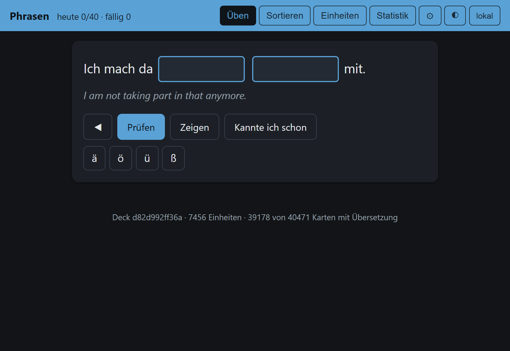
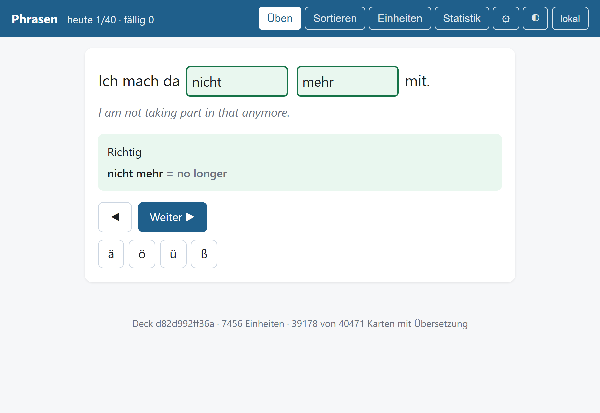
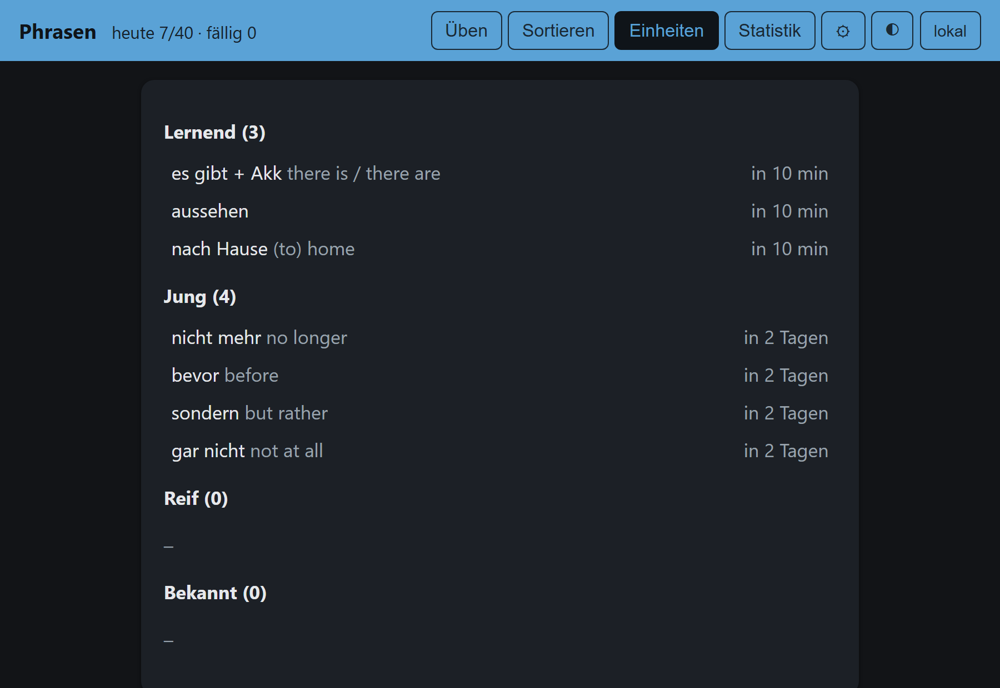
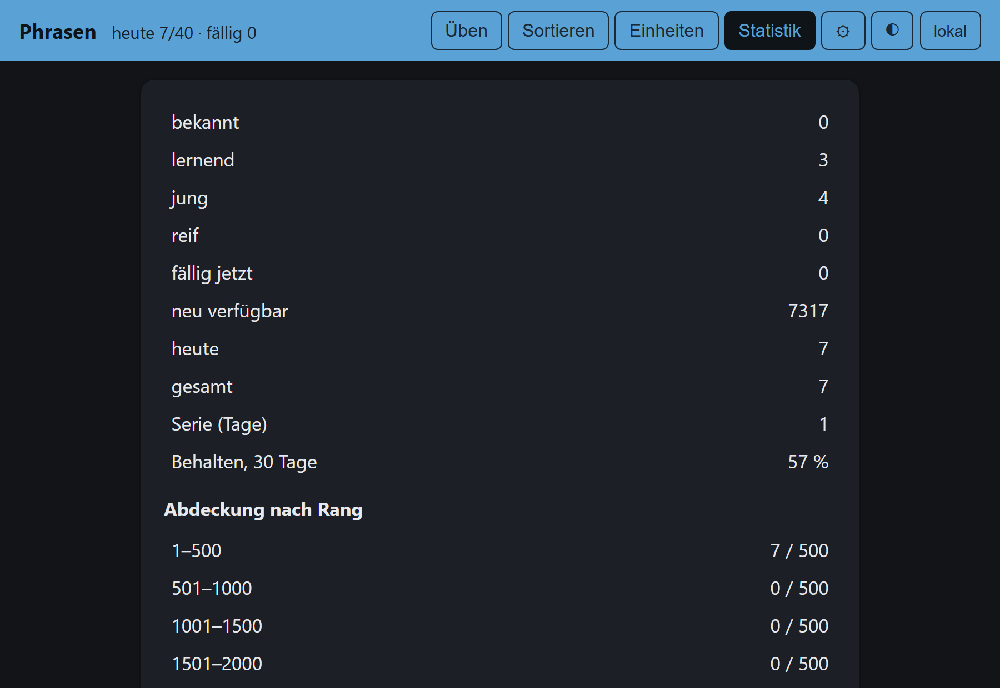
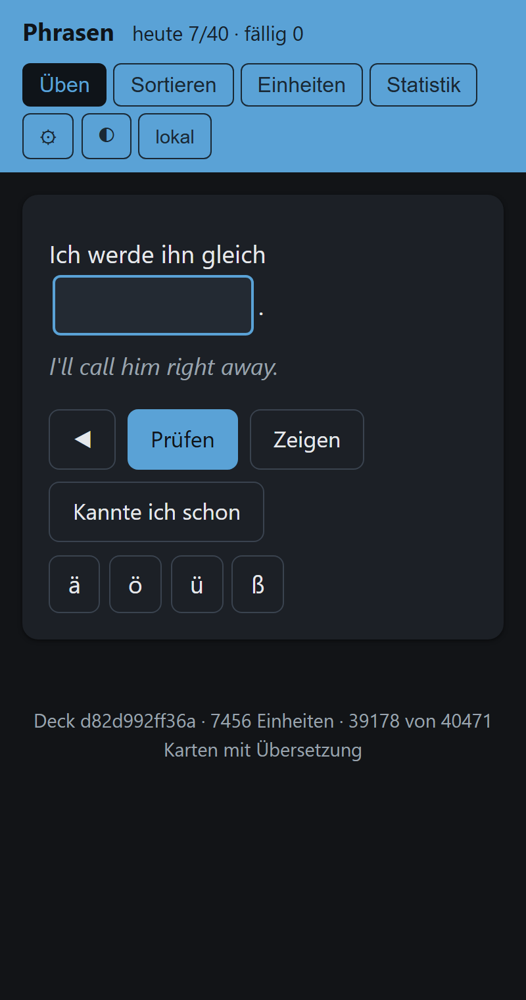

# Phrasen: a German vocabulary trainer

A spaced-repetition trainer that teaches German words **and** the phrases they
live in. Every card is a real sentence from a corpus with one unit blanked out,
plus its English translation. You type what is missing; FSRS decides when you
see it again.

**Try it:** <https://mertalpaydin.github.io/spaced-repetition-app-for-german/>
(works offline after the first visit, installs as an app on Android and desktop Chrome).

<p align="center">
  
</p>

## What it teaches

A word list teaches `warten`. German is also spoken in `warten auf + Akk`,
`sich interessieren für`, `aufstehen`, `eine Entscheidung treffen`,
`zwar … aber`, `auf jeden Fall`. Both are vocabulary, so the deck mines both
and ranks them together.

| | Kinds | Units |
|---|---|---:|
| **Words** | noun (with its gender), verb, adjective, adverb | 8,882 |
| **Phrases** | verb + preposition, reflexive verb, separable verb, noun + verb, adjective + verb, adjective + noun, connector, two-part connector, idiom, fixed expression | 7,195 |

16,077 units and 73,785 cards in the deck as it stands.

A phrase is taught in every surface form the corpus uses: `wartet auf`,
`wartete auf`, `warte … auf`, `gewartet auf`. It may be split across the
sentence, and then the card has several gaps. A word is taught the same way,
in the case or tense the sentence happens to need.

Words and phrases are **interleaved** rather than sorted into one frequency
order. A word is always at least as frequent as any phrase containing it, so a
single ranking would put some two thousand words ahead of almost every phrase.
Six words to four phrases, each group in its own frequency order, is the
default and a setting.

Every unit shows its English after the answer, most common rendering first
(`aussehen: to look / to appear`), and a hint before it.

## What it looks like

| Answer graded, unit revealed | Your units by stage |
|---|---|
|  |  |

| Statistics | On a phone |
|---|---|
|  |  |

Typing is graded with a scoped typo tolerance: one edit outside the inflected
ending counts as a typo (rated "hard"), an edit that changes the grammar
(`dem` for `den`, `hatte` for `hätte`) counts as wrong. `ae`, `oe`, `ue` and
`ss` are accepted for umlauts and ß. A sentence-initial gap accepts lower case.
Connectors that translate alike accept each other.

## How it is built

**The deck is mined, not written.** No model writes German. Six corpora
(Tatoeba, four Leipzig packages, an OpenSubtitles sample, about four million
sentences) are parsed once with spaCy. Deterministic detectors find each kind
from the dependency parse: a preposition governed by a verb, a reflexive
pronoun that agrees with its subject, a separable prefix attached to its verb,
a noun-verb pair with a high log-likelihood ratio, an adjective that forms a
set phrase with a verb. Units are ranked by how many distinct sentences use
them, with everyday corpora weighted up so that `jedoch` does not outrank
`nicht mehr`.

**A fixed expression has no grammar to find it by.** `auf jeden Fall`,
`tut mir leid`, `soweit ich weiß` are held together by usage, so they are
mined from surface n-grams counted over the whole corpus instead, scored by
the weakest seam (the lowest mutual information over every way of cutting the
sequence in two). That measure alone ranks proper names highest, so a
candidate must also be built of dictionary words, must earn a share of its
count from everyday speech rather than the news wire, and grows to the longest
span the corpus never leaves bare (`erster Linie` becomes `in erster Linie`,
763 of its 766 uses).

**A single word needs bounding.** It occurs in millions of sentences, so the
detector emits only from sentences that already carry a trusted translation,
because no other sentence could become a card anyway, and at most a dozen per
corpus. Its frequency for the ranking comes from a separate pass that counts
every sentence, so capping the carriers never distorts the order. A word must
be in the CEFR list or the dictionary filter to be mined at all, which keeps
names, typos and rare compounds out.

**Cards need a trusted translation.** Only sentences with a machine
translation (Azure Translator or Gemini) become cards; the corpus's own crowd
translations are never shown. A sentence-initial connector (`Trotzdem …`) gets
a one-sentence context so the connector is answerable.

**Two reviewers read the cards, from the top down.** Every card and unit is
read by two independent model reviewers under a zero-defect policy, and every
systematic finding becomes a mining rule with a test rather than an exclusion:
the two bands read so far turned 1,478 findings into eleven rules that
removed some 1,500 units, against about 100 excluded by hand. The deck is
16,077 units, far more than a year of
learning, so the review walks down the ranking in steps and is complete to
rank 2000; the tail below that is read before the learner reaches it.

**The page is the whole product.** `web/` is plain ES modules with no build
step and no npm dependency. The FSRS-6 scheduler, the grader, the session
logic and the review-log replay are ports of the Python originals in `src/`,
and node tests pin each port against fixtures the Python side generates, so a
log replays to the same due dates on both. The review log is an append-only
JSONL; it lives in IndexedDB and, with a fine-grained GitHub token (gist scope
only), in a private gist that every device merges, so the laptop and the phone
keep one log. A service worker caches the shell and the deck by version for
offline use.

```text
corpora ──parse──▶ occurrences ──mine──▶ ranked units ──cards──▶ deck (JSON shards)
                                                                      │
                                       GitHub Pages ◀──── web/ ◀──────┘
                                       browser: FSRS · grader · IndexedDB log · gist sync
```

## Stack

Python 3.12, spaCy (`de_core_news_sm`), pydantic, py-fsrs, pytest with
hypothesis and a coverage gate, ruff, mypy strict. Browser: vanilla ES
modules, IndexedDB, service worker, node:test. CI on GitHub Actions; the
page deploys from the repository on every push.

## Run it yourself

```bash
uv sync                                                   # Python deps and the German spaCy model
uv run pytest -q                                          # the whole suite, no network, no key
uv run python -m src.cli.serve                            # the page on http://localhost:8765
uv run python scripts/build_phrase_deck.py --stage all    # rebuild the deck (needs the corpora, see docs/phrase-deck.md)
```

The terminal client (`uv run python -m src.cli.train practice`) runs the same
engine on the same log format without a browser. Growing the deck (new
translations, review, rebuild) is a manual round described in
`docs/phrase-deck.md`.

## Where to read next

| File | What it gives you |
|---|---|
| `docs/project-state.md` | What works, what does not, what is risky. |
| `docs/phrase-deck.md` | The deck build runbook. |
| `docs/monthly-translation-job.md` | The Azure gloss top-up. |

Licence: `LICENSE.md`.
